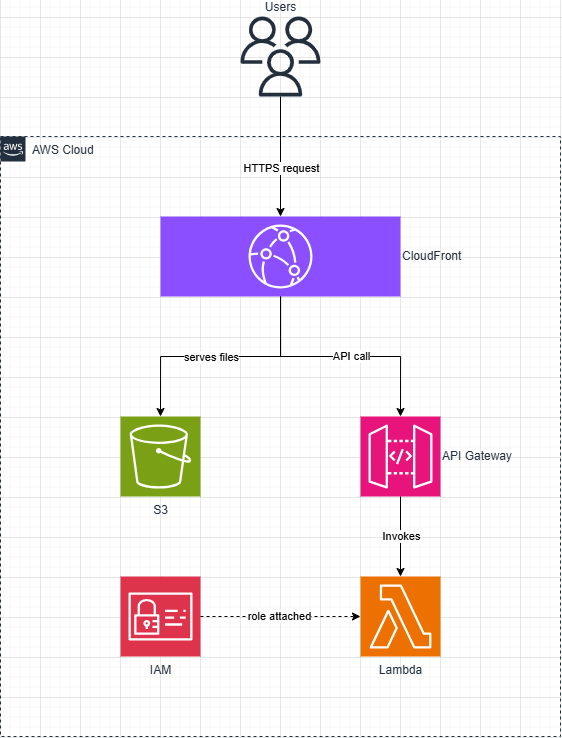

# AWS Quote Generator

A serverless web application built on AWS, developed as part of my cloud learning journey 

working towards AWS Solutions Architect certification.

## Live Demo

[View the live app](https://d2xf7y5ptg1op.cloudfront.net/)

---

## What It Does

A simple web app that returns a random motivational quote at the click of a button. 

The frontend calls a live AWS API which triggers a Python function to return a quote.

---

## Architecture

| Layer | Service | Purpose |
|---|---|---|
| Frontend | Amazon S3 | Hosts the static HTML/CSS/JS webpage |
| CDN | Amazon CloudFront | Global delivery and HTTPS |
| API | Amazon API Gateway | Exposes the backend via a public URL |
| Backend | AWS Lambda (Python) | Serverless function that returns a random quote |
| Security | AWS IAM | Role-based access between services |

---

## Architecture Decisions

### Why Lambda over EC2?

Lambda is serverless — there is no server to manage or keep running. 

For a simple API that receives occasional requests, Lambda is significantly cheaper 

(AWS Free Tier covers 1 million requests/month) and requires zero infrastructure management. 

EC2 would be over-engineered for this use case.

### Why S3 for the frontend?

S3 static website hosting serves HTML files directly to browsers with no web server needed. 

Combined with CloudFront it delivers the page globally with low latency and automatic HTTPS — 

at a fraction of the cost of running a dedicated web server.

### Why CloudFront?

CloudFront sits in front of S3 to provide three things: HTTPS, global edge caching for 

fast load times worldwide, and a security layer that means the S3 bucket itself 

does not need to be publicly accessible.

---

## Security Considerations

- S3 bucket is **not** publicly accessible — all traffic routes through CloudFront only

- Lambda function uses a least-privilege IAM role (no unnecessary permissions)

- HTTPS enforced via CloudFront viewer protocol policy

- CORS headers configured on the API to control which origins can call it

---

## What I Learned

- How serverless compute works and when to use it over traditional servers

- The request/response cycle between frontend and backend via REST APIs

- How IAM roles control service-to-service permissions in AWS

- How CloudFront Edge Locations differ from AWS Regions

- Practical experience with the AWS Console across five core services

---

## What I Would Add in Production

- Authentication (Amazon Cognito) so users can have personal saved quotes

- A database (DynamoDB) to store and manage quotes dynamically

- Input validation and error handling on the Lambda function

- CloudWatch monitoring and alerting

- CI/CD pipeline to automate deployments (AWS CodePipeline)

---

## AWS Services Used

`Lambda` `API Gateway` `S3` `CloudFront` `IAM`

## Certifications Being Pursued

- AWS Cloud Practitioner *(in progress)*

- AWS Solutions Architect Associate *(planned)*

